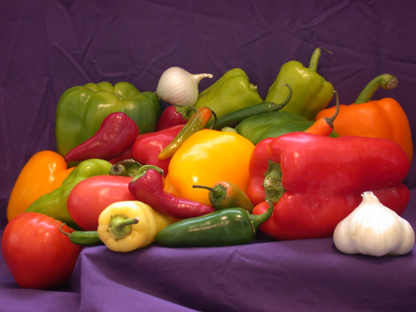
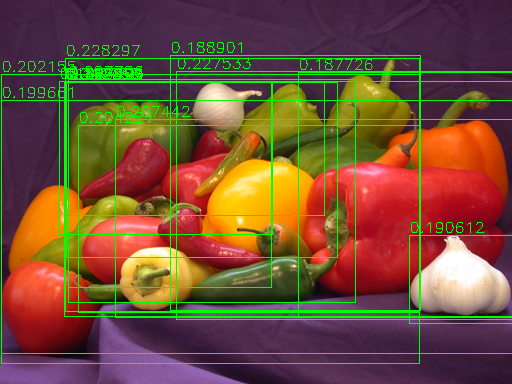

### Introduction

This is a c++ implementation of pdollar's [Structured Edge Detection Toolbox](https://github.com/pdollar/edges).
https://pdollar.github.io/files/papers/ZitnickDollarECCV14edgeBoxes.pdf
    
	
Clone from:
https://github.com/AlexMa011/edgeBoxes-Cpp-version
### Dependencies

[Opencv2](http://opencv.org/downloads.html)
 is required. The installation documentation can be find [here](http://docs.opencv.org/2.4/doc/tutorials/introduction/table_of_content_introduction/table_of_content_introduction.html).
 (Note: opencv 3 is also plausible if the writeout function in gadgets.cpp is modified to suit opencv3.)
And you need to install the matiolib(needed to load model in mat format). Download the [matio package](https://sourceforge.net/projects/matio/) and  install the matio library.

If you are using Mac OS with homebrew, just use brew install to install opencv2 and libmatio.


### Getting Started
Switch to the main folder, and type the following command to run compile and run:
```code:
$ cmake .
$ make
$ ./edgebox
```
Remember to delete CMakeCache.txt if needed.


If you want to see the pic immediately, set the showpic para to be 1.
The result image is stored in output folder.

Tools folder contains function for image processing.
The parameters.cpp file contains function about loading model, type conversion and initialize
parameters. Parameters can be changed in initial_para() function in parameters.cpp.

### Demo

##### Origin image: 


##### Edge image: 


##### Detection image: 

